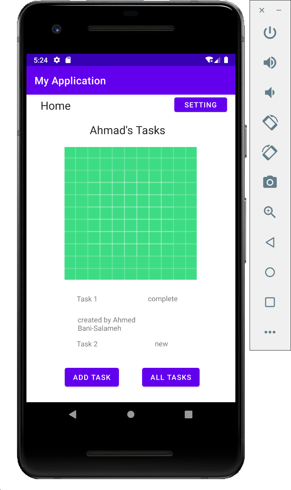
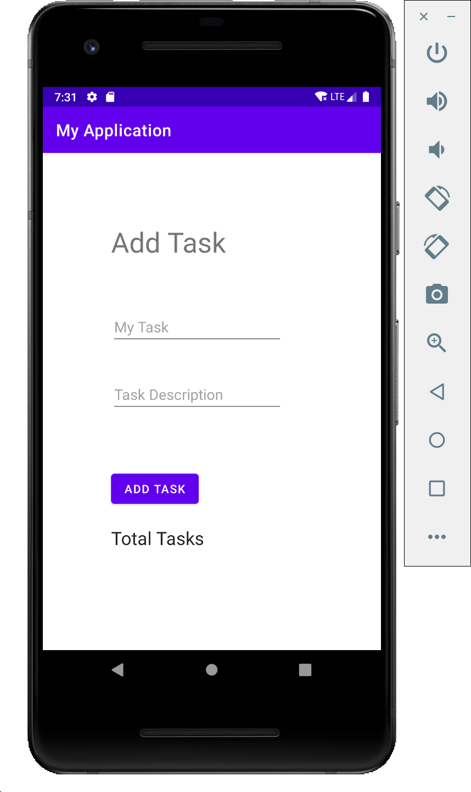
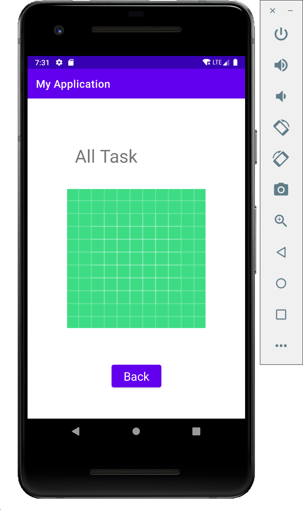
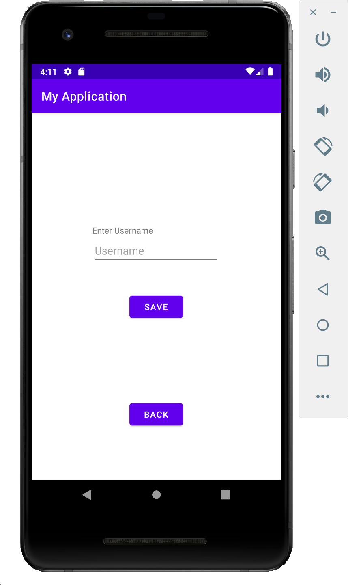
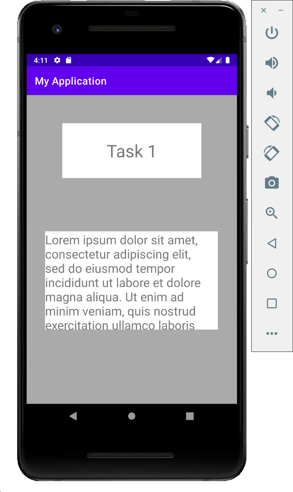

# Task-Master

## Description 

Task-Master is an application where you can organize tasks and also add tasks to the app 

  

## version 1.0.0

- the add task when you click it opens a form to add a task 

 

  

- the all tasks where you can see all the tasks  

  

## version 1.0.1

- added a new feature which is the settings where you can write your name and save then it will show the user name in the home screen  

  

- added 3 new tasks when you press on them they will show you the details of that task  

  

## version 1.0.2  

The home screen have been modified instead of having buttons for tasks all over the home screen there will be a scroll down box that contains the tasks, for the tasks it will show the title of the task, the body body of the task and its state, when you click on one of the tasks it will show you its details. 

## version 1.0.3

+ **Homepage**
The main page should be modified to contain a rendered list of tasks (title, body and state) inside a recycler view which are retrieved from the Room database. When a user taps one of the titles, it should go to the Task Detail page, which desplays the task details.

+ **AddTask**
In this activity you can add a new task by adding it's title, body and state in the input fields, and click submit. The data will be stored inside the Room database. 

+ **Task Detail Page**
Create a Task Detail page. It should have a title at the top of the page, with the state beside it, and the body underneath.  

## version 1.0.4

+ Modified the Add Task form to save the data entered in as a Task to DynamoDB.

+ Refactor the homepage’s RecyclerView to display all Task entities in DynamoDB.

## Devs 

- **Ahmed Bani-Salameh**